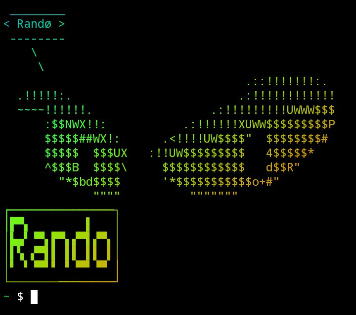

# DEVIL-EYE
<p align="center">
> Do you wanna feel like a Geek? Devil-Eye can customize your termux and can add devil-eye banner in termux, which looks cool and awesome and give feel like a Geek.

Use the following commands to install the necessary dependencies:

```bash 
apt update
apt upgrade -y 
apt install git -y 
```
## Usage

Clone the sandip repository from GitHub:

```bash
git clone https://github.com/Sandipeyy/DEVIL-EYE
```

Navigate to the sandip directory:

```bash
cd DEVIL-EYE
```

Run the script:

```bash
bash devil-eye
```

## Message:
For Graphical Mode, use command ``devil-eye``

For Command-Line-Interface, use command ``devil-eye [-arg]``

# Available Args:
`` devil-eye -r ``  -  To install requirements 

`` devil-eye -h ``  - Visit help page

`` devil-eye -t [banner name] [user name] `` - To install Devil-Eye in Termux 


